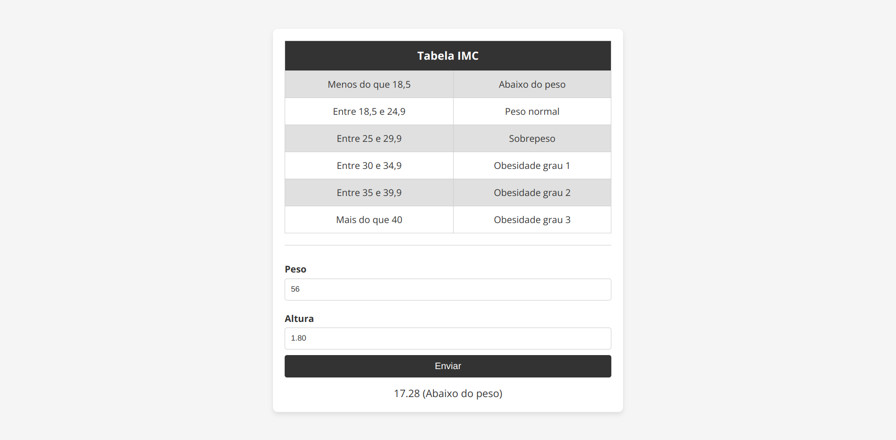

# Calculadora IMC

⭐ Exercício de JavaScript!

Uma simples calculadora IMC que foi desenvolvida como um exercício durante o curso **JavaScript** e **TypeScript** do básico ao avançado, do professor **Luiz Otávio Miranda**.

* [Ver projeto](https://alemobn.github.io/imc-calculator-js/)
* [Repositório Pai](https://www.github.com/alemobn/study_javascript-typescript-luizomf)
* [Curso](https://www.udemy.com/course/curso-de-javascript-moderno-do-basico-ao-avancado/learn/lecture/16342392?start=0#overview)

Projeto desenvolvido com objetivo de praticar conceitos de Lógica de Programação.

